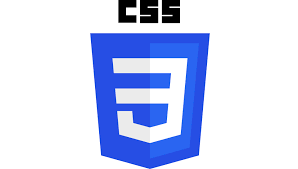

### AboutMe
```javascript
const Andrés = {
 name: "Andrés",
 lastName: "Monsalbe",
 age: 32,

}
```

- 🔭 Mi nombre es Andrés Monsalbe, tengo 32 años y soy desarrollador FullStack
- 🌱 Me gusta estar aprendiendo cosas nuevas todo el tiempo y encontré en la programación la posibilidad de poder mantenerme activo y enfocado.
- 👯 Me gusta formar parte de grupos de trabajos y poder compartir conocimientos con personas con intereses en común.
- 👀 Estoy buscando trabajo como desarrollador Full-Stack. 

<br>

###  Tengo conocimientos en: 
<p align ="center" >
  
  
  
  
  
  
  
  
  

</p>

###  Me pueden contactar por: 

 - email: monsalbefotografia@gmail.com ,
 - linkedin: https://www.linkedin.com/in/fullstack-andres-monsalbe/ ,

<br>

###  Además de la programación me gustan:

 ```javascript
const intereses = {
viajar: 'Preferentemente en moto y por la montaña🛵',
fotografía: 'Regristro documental de eventos y los retratos📸',
video: 'Edición y toma 🎬',
cocina: 'Cooking is science 🔬'
```


